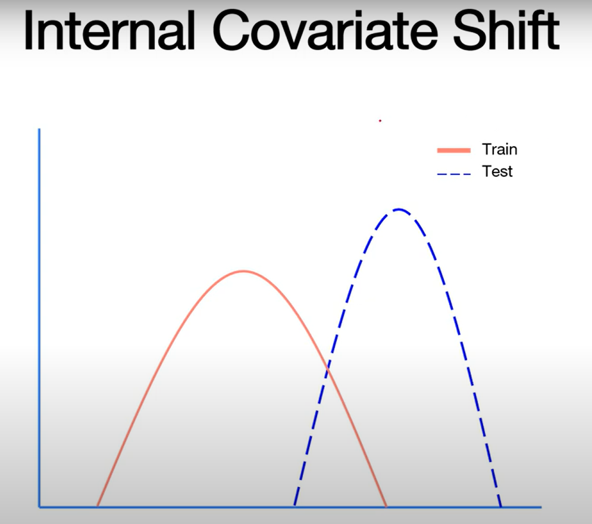
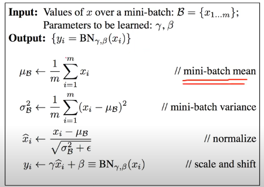

# 배치 정규화 (Batch Normalization)

> 테마: 05_training_techniques · 예제: [`example.ipynb`](./example.ipynb) · 실습: [`practice.ipynb`](./practice.ipynb)

## 한 줄 요약
각 레이어의 출력을 미니배치 단위로 평균 0, 분산 1로 정규화해 internal covariate shift를 줄이고 기울기 소실/폭발을 직접 완화한다.

## 핵심 개념
- **Gradient Vanishing / Exploding**: 기울기가 너무 작아져 사라지거나(vanishing) 너무 커지는(exploding) 현상.
- **간접적 해결책**: 활성화 함수 변경(ReLU), 신중한 초기화(Xavier/He), 작은 learning rate. 이들은 간접적 완화책이다.
- **Internal Covariate Shift**: 레이어가 쌓일수록 각 레이어의 입력 분포가 학습 중 계속 변하는 현상. 레이어가 많을수록 심해져 학습을 어렵게 만든다.



- **Batch Normalization (직접적 해결책)**: 각 레이어마다 정규화 레이어를 두어 미니배치마다 출력 분포가 한쪽으로 치우치지 않게 한다.

## 원리 / 수식



- 미니배치의 평균 $\mu_B$와 분산 $\sigma_B^2$를 구해 입력 $x$를 정규화한다:
  $$\hat{x} = \frac{x - \mu_B}{\sqrt{\sigma_B^2 + \epsilon}}$$
  - $\epsilon$: 분산이 0이 되어 나눗셈이 터지는 것을 막는 아주 작은 수.
- 정규화 결과에 **scale($\gamma$), shift($\beta$)** 변환을 더해 $y = \gamma \hat{x} + \beta$를 만든다.
  - 정규화만 계속하면 표현력(non-linearity)이 줄 수 있으므로 이를 보정하는 학습 가능한 파라미터다.
  - $\gamma, \beta$도 gradient와 back-propagation에 따라 갱신된다.

## PyTorch 구현 포인트
- 완전연결: `nn.BatchNorm1d(num_features)`, 합성곱: `nn.BatchNorm2d(num_channels)`.
- 보통 선형/합성곱 → BN → 활성화 순서로 배치한다:
```python
model = nn.Sequential(
    nn.Linear(784, 256), nn.BatchNorm1d(256), nn.ReLU(),
    nn.Linear(256, 10))
```
- **train/eval 모드 중요**: 학습 시는 미니배치 통계를, 평가 시는 누적된 이동평균(running stats)을 사용하므로 `model.train()`/`model.eval()`을 반드시 전환한다.

## 자주 하는 실수 / 팁
- `model.eval()`을 빼면 평가 시에도 배치 통계를 써서 결과가 배치 구성에 따라 흔들린다.
- 배치 크기가 너무 작으면 배치 통계가 불안정해 BN 효과가 떨어진다.
- dropout과 함께 쓸 때는, BN은 dropout되지 않은 상태로 통계를 계산한 뒤 dropout 학습을 진행하는 식으로 상호작용에 주의한다.
- BN을 쓰면 다소 큰 learning rate도 안정적으로 쓸 수 있고 초기화 민감도가 줄어든다.

## 예제 노트북 요약
- `example.ipynb`는 Gradient Vanishing/Exploding과 Internal Covariate Shift를 설명하고, 그 직접적 해결책으로 Batch Normalization의 정규화 + scale/shift 수식을 그림과 함께 정리한다.

## 더 보기
- ReLU와 기울기 소실: [`../01_relu_activation/concept.md`](../01_relu_activation/concept.md)
- 가중치 초기화: [`../02_weight_initialization/concept.md`](../02_weight_initialization/concept.md)
- 드롭아웃: [`../03_dropout/concept.md`](../03_dropout/concept.md)
